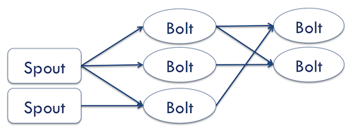
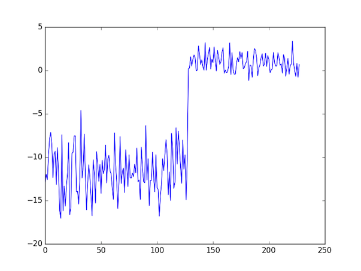
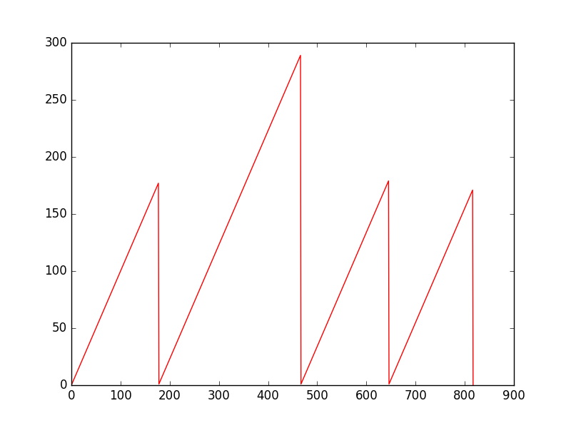
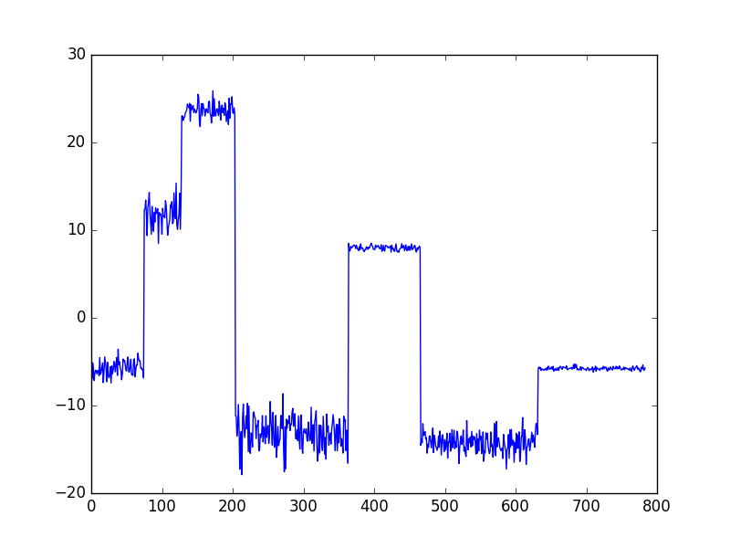
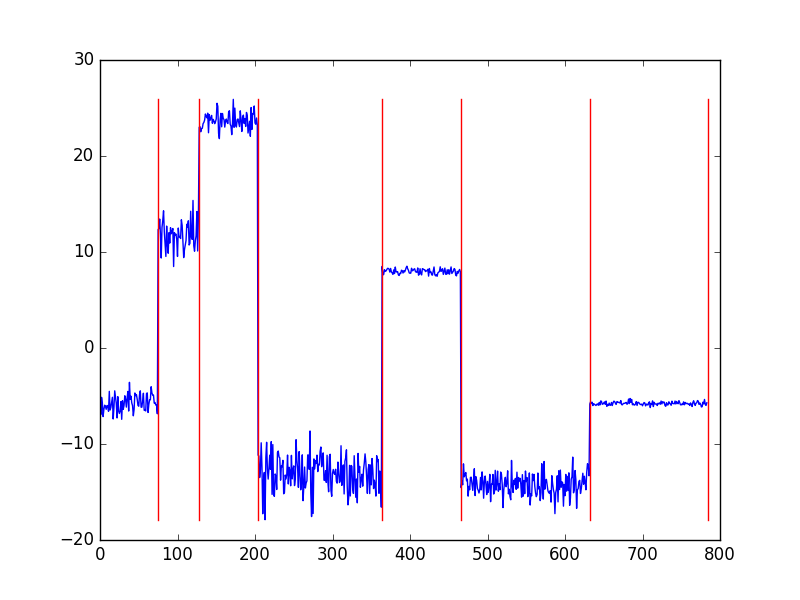

= Analiza strumieniowa w Internecie Rzeczy
:revealjs_theme: white
:revealjs_control: false
:revealjs_slideNumber: true
:revealjs_history: true

Dominik Waśniowski

opiekun naukowy dr inż. Janusz Granat

== Cel pracy

Wykrywanie sytuacji nietypowych z wykorzystaniem technik analizy strumieniowej

Test obecnych platform do analizy strumieniowej

== Agenda

* Internet Rzeczy
* Platformy
* Sytuacje nietypowe
* Co zostało

== Internet Rzeczy

* Miliony czujników, urządzeń podłączonych do sieci
* Możliwość wcześniejszego ostrzegania o sytuacjach niebezpiecznych
* Jeszcze więcej danych generowanych przez nie

== Analiza strumieniowa

* Dane napływają na bierząco, strumieniem
* Dane przetwarzane niezależnie, bezpośrenio po otrzymaniu

== Analiza strumieniowa

.Platformy
* Esper
* Apache Spark
* Apache Storm

Test: wykrywanie anomalii w obszarze telokomunikacji

== Esper

* Silnik obsługi zdarzeń.
* Sql podobny język.

[source, language="sql"]
----
select
  cs1.callingNum , cs1.switchNum,
  cs2.callingNum , cs2.switchNum
from
  CallEvent.win:time(5 sec) as cs1, CallEvent.win:time(5 sec) as cs2
where
  cs1.callingImsi = cs2.callingImsi
  and cs1.switchNum != cs2.switchNum
----

== Esper - zalety

* Prosta instalacja i użytkowanie
* Ekspresyjny język
** Operacje na pojedyńczych rekordach
** Filtrowanie
** Agregacja
** Funkcje czasowe (window-sliding)

== Esper - wady

* Brak wsparcia skalowalności
* Dane trzymane w pamięci

== Apache Spark

.Zalety
* Wsparcie skalowalności
* Liczne moduły

.Wady
* Analiza strumieniowa jest pobocznym modułem
* Skomplikowany sposób użytkowania

== Apache Storm

.Zalety
* Analiza w czasie rzeczywistym *
* Wsparcie skalowalności

.Wady
* Wysoki próg wejścia
* Brak wbudowanych modułów umożliwiających zaawansowane operacje

== Dlaczego Storm

* Analiza w czasie rzeczywistym
* Skalowalność
* Sposób reprezentacji zadania

== Sytuacje nietypowe

* Zmiana charakterystyki
** Chwilowe
** Permanentne
* Wartości odstające (outliers)
* Inne

== Wykrywanie zmian

* Wykrywanie zmian charakterystyk w czasie
* Zmiany parametrów definiujących rozkład

== Wykrywanie zmian

Wykrywanie zmian z pomocą prawdopobieństwa Bayesa
ang. Bayesian online change point detection

* Możliwość wykorzystania dla różnych typów danych wejściowych
* Konieczność pamiętania wartości wyłącznie od ostatniej zmiany

== Algorytm Bayesa

* Przebiegi, dane zebrane od teraz do poprzedniej zmiany
* Znamy wcześniejszy rozkład próbek
* Nowa wartość należy do akualnego przebiegu, bądź nastąpiła zmiana

== Funkcja przebiegu w czasie

== Przykład - dane wejściowe

== Wynik

== Co zostało

* Opracowanie własnej metody wykrywania sytuacji nietypowej
* Testy

== Dziękuje za uwagę
